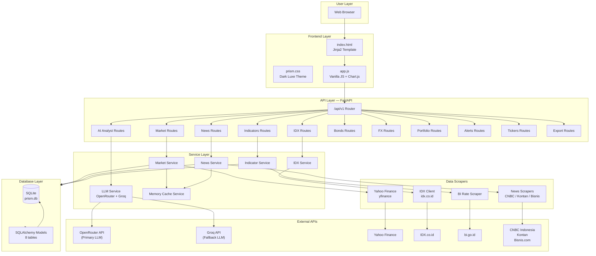
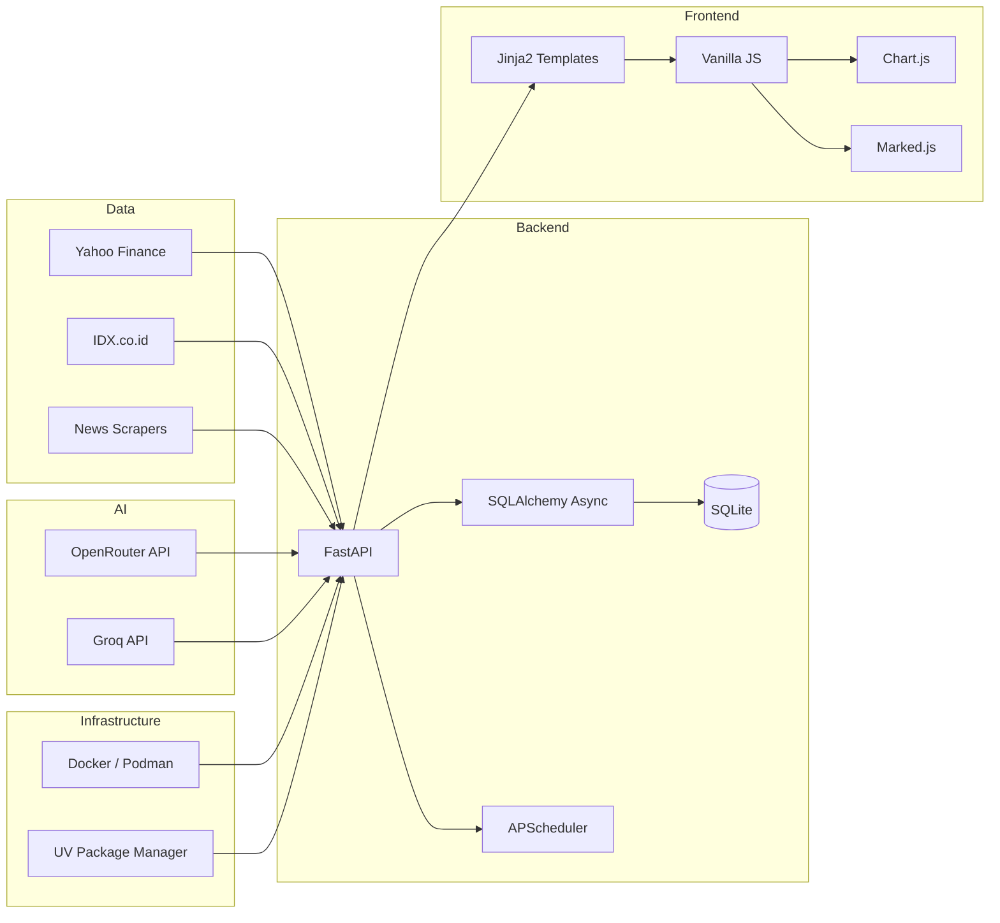
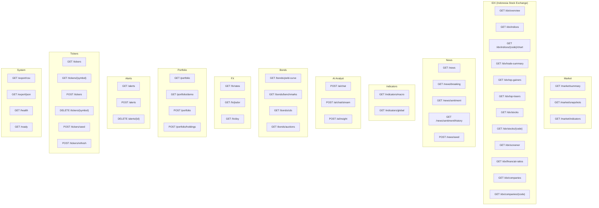
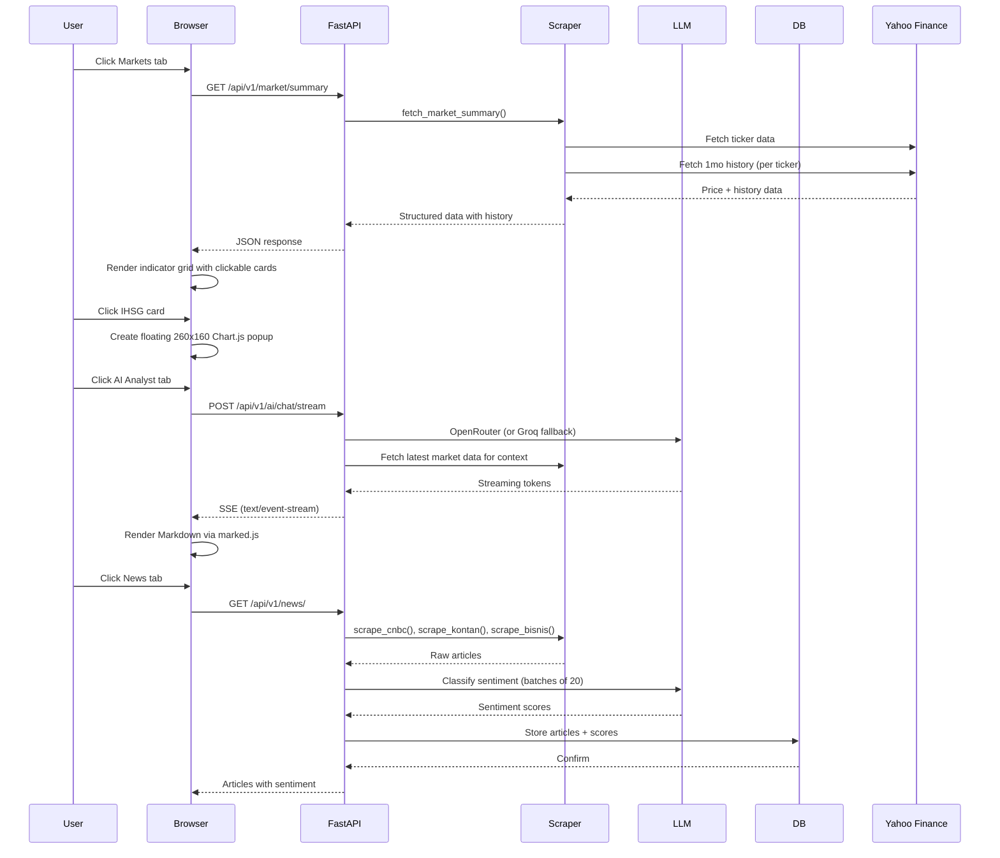
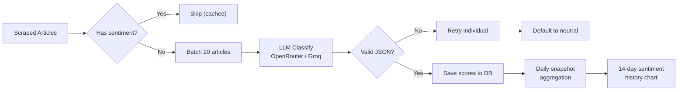

# PRISM — Portfolio Research & Investment Strategy Monitor

**Indonesia's Financial Pulse. All in One Terminal.**

PRISM is a self-hosted Indonesian financial intelligence terminal that aggregates real-time market data, macroeconomic indicators, news sentiment analysis, and AI-powered market insights into a unified web dashboard.



---

## Features

- **Real-time Market Data** — IHSG, LQ45, USD/IDR, DXY, Brent Crude, Gold via Yahoo Finance
- **IDX Integration** — All 44 IDX indices, stock screener (957+ stocks with PER/PBV/ROA/ROE), trade summary, company profiles, financial ratios
- **BI Rate Tracking** — Verified BI-7DRR history with 30-month timeline, scraped from bi.go.id
- **Macroeconomic Indicators** — Inflation (CPI), GDP growth, trade balance, banking metrics, fiscal data
- **News Aggregation** — Scraped from CNBC Indonesia, Kontan, Bisnis.com with LLM-based sentiment classification
- **AI Analyst** — Streaming chat with OpenRouter (primary) + Groq (fallback) LLMs, context-aware with real market data
- **Fixed Income** — Yield curve, benchmark bonds, CDS spreads
- **Forex** — Major pair rates + BI JISDOR
- **Portfolio Tracking** — Demo portfolio with cost basis, P&L, and holdings
- **Custom Alerts** — Price and news keyword alerts
- **Ticker Management** — Add, delete, refresh individual tickers
- **Export** — CSV and JSON export of all data

---

## Tech Stack



| Category | Technology |
|---|---|
| **Language** | Python 3.11+ |
| **Web Framework** | FastAPI (async) |
| **ORM** | SQLAlchemy 2.0 (async) |
| **Database** | SQLite (default), PostgreSQL-ready |
| **Template Engine** | Jinja2 |
| **Frontend** | Vanilla JavaScript, CSS3 |
| **Charts** | Chart.js 4.x |
| **Markdown** | Marked.js |
| **LLM** | OpenRouter (primary) + Groq (fallback) |
| **Market Data** | yfinance |
| **News Scraping** | scrapling |
| **Task Scheduler** | APScheduler |
| **Package Manager** | UV |
| **Container** | Docker / Podman |
| **CI** | podman-compose |

---

## Quick Start

### Prerequisites

- Python 3.11+
- [UV](https://github.com/astral-sh/uv) package manager
- OpenRouter API key (or Groq API key)

### Local Development

```bash
# Clone and enter the project
cd prism

# Install dependencies
uv sync

# Copy environment file
cp .env.example .env
# Edit .env with your API keys

# Run the development server
uv run uvicorn app.main:app --reload --port 8000
```

Open http://localhost:8000 in your browser.

### Docker / Podman

```bash
# Build and start
podman-compose up -d

# Or with Docker Compose
docker compose up -d
```

### Configuration

Create a `.env` file:

```env
# LLM Configuration (at least one required)
OPENROUTER_API_KEY=sk-or-v1-your-key
GROQ_API_KEY=gsk_your-key
LLM_PROVIDER=openrouter    # or "groq"

# Optional
DATABASE_URL=sqlite+aiosqlite:///./data/prism.db
```

---

## API Endpoints

All endpoints are prefixed with `/api/v1`.



---

## Data Flow



---

## Architecture

### Backend Structure

```
app/
├── main.py                  # FastAPI app entry, lifespan, static mounts
├── config.py                # Pydantic settings (.env)
├── api/                     # Route handlers
│   ├── router.py            # Central router mounting all sub-routers
│   ├── market.py            # Market summary, snapshots
│   ├── news.py              # News feed, sentiment
│   ├── indicators.py        # Macro & global indicators
│   ├── idx.py               # IDX stock exchange data
│   ├── bonds.py             # Fixed income
│   ├── fx.py                # Forex
│   ├── portfolio.py         # Portfolio management
│   ├── ai_analyst.py        # AI chat + streaming
│   ├── alerts.py            # Custom alerts
│   ├── tickers.py           # Ticker CRUD
│   └── export.py            # CSV/JSON export
├── scrapers/
│   ├── market/
│   │   ├── yahoo_fetcher.py # Yahoo Finance integration
│   │   └── bi_scraper.py    # Bank Indonesia rate scraper
│   ├── news/
│   │   └── cnbc_scraper.py  # CNBC/Kontan/Bisnis scraper
│   └── idx/
│       ├── idx_client.py    # IDX HTTP client (cookies, retry)
│       ├── market.py        # IDX indices & trade summary
│       ├── trading.py       # IDX stock summary & trades
│       └── company.py       # IDX company profiles & screener
├── services/
│   ├── market_service.py    # Market orchestration
│   ├── news_service.py      # News + sentiment orchestration
│   ├── idx_service.py       # IDX data orchestration
│   ├── indicator_service.py # Macro indicators
│   ├── llm_service.py       # OpenRouter + Groq LLM client
│   └── cache_service.py     # In-memory TTL cache
├── database/
│   ├── models.py            # 8 SQLAlchemy models
│   └── session.py           # Async session factory
├── utils/
│   ├── logger.py            # Loguru configuration
│   └── formatters.py        # Number/currency formatters
├── static/
│   ├── css/prism.css        # Dark Luxe theme (1179 lines)
│   └── js/app.js            # Frontend logic (919 lines)
└── templates/
    └── index.html           # Single-page application shell
```

### Database Schema

```mermaid
erDiagram
    NewsArticle {
        str id PK
        str title
        str summary
        str url UNIQUE
        str source
        datetime published_at
        str language
        float sentiment
        bool is_breaking
        json ticker_mentions
        json tags
        datetime created_at
    }

    MarketSnapshot {
        int id PK
        str symbol
        str snapshot_type
        float last_price
        float change
        float change_pct
        float volume
        datetime timestamp
    }

    MacroIndicator {
        int id PK
        str indicator_name
        float value
        float previous_value
        float change
        str period
        str unit
        str source
        str category
        date published_at
        datetime created_at
    }

    DailyInsight {
        int id PK
        date date UNIQUE
        text content_md
        str model_used
        datetime generated_at
    }

    Portfolio {
        int id PK
        str name
        datetime created_at
    }

    Holding {
        int id PK
        int portfolio_id FK
        str ticker
        float quantity
        float avg_price
        str currency
        datetime opened_at
    }

    Alert {
        int id PK
        str alert_type
        str symbol
        str condition
        float threshold
        str keyword
        bool is_active
        datetime triggered_at
        datetime created_at
    }

    NewsSentimentSnapshot {
        int id PK
        date date UNIQUE
        int total
        int positive
        int neutral
        int negative
        float pct_positive
        float pct_neutral
        float pct_negative
        float score
        datetime created_at
    }

    Portfolio ||--o{ Holding : contains
```

---

## LLM Sentiment Classification

News sentiment is classified using LLM (not keyword matching) for accurate context-aware analysis. For example, *"IHSG naik"* is positive but *"Pertamax naik"* is negative.



---

## Deployment

### Production Build

```bash
# Build with podman
podman-compose build

# Run
podman-compose up -d

# View logs
podman logs -f prism-terminal

# Stop
podman-compose down
```

### Container Details

- **Base image**: `python:3.11-slim` (two-stage build)
- **Builder**: `ghcr.io/astral-sh/uv:latest`
- **Port**: 8000
- **Healthcheck**: `GET /health` every 15s
- **Volumes**:
  - `db_data:/app/data` — SQLite database persistence
  - `./logs:/app/logs` — Application logs
  - `./exports:/app/exports` — CSV/JSON exports
  - `./.env:/app/.env:ro` — Environment configuration

### Environment Variables

| Variable | Required | Default | Description |
|---|---|---|---|
| `OPENROUTER_API_KEY` | Yes* | — | OpenRouter API key (primary LLM) |
| `GROQ_API_KEY` | Yes* | — | Groq API key (fallback LLM) |
| `LLM_PROVIDER` | No | `openrouter` | Active LLM provider |
| `DATABASE_URL` | No | `sqlite+aiosqlite:///./data/prism.db` | Database connection string |
| `TZ` | No | `Asia/Jakarta` | Timezone |

*\*At least one LLM API key is required.*

---

## Development

### Running Tests

```bash
# All tests
uv run pytest

# Specific module
uv run pytest tests/test_api_market.py -v

# With coverage
uv run pytest --cov=app
```

### Adding a New Data Source

1. Create a scraper in `app/scrapers/` (follow existing patterns)
2. Add a service method in `app/services/`
3. Add API routes in `app/api/`
4. Register in `app/api/router.py`
5. Add frontend rendering in `app/static/js/app.js`
6. Write tests in `tests/`

---

## License

MIT
